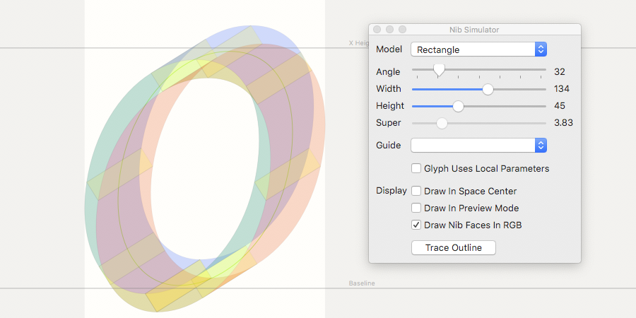
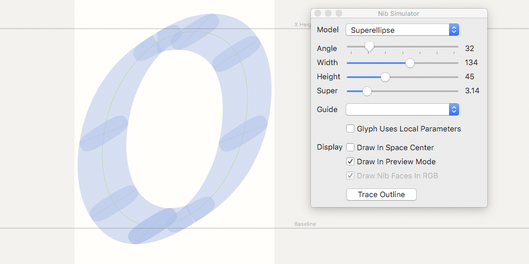

# nibLib

Nib simulation library for font editors (well, RoboFont at the moment).

## Available nib shapes

* Rectangle (with tracing to outlines)
* Oval
* Superellipse

## Screenshots

## Installation

### RoboFont

Put the folder `nibLib` from `lib` somewhere RoboFont can import Python modules from, e.g. `~/Library/Application Support/RoboFont/external_packages`.

Open the script `NibLibRF.py` in RoboFont’s macro panel and run it.

## Known bugs

* This is a development version, everything may be broken.
